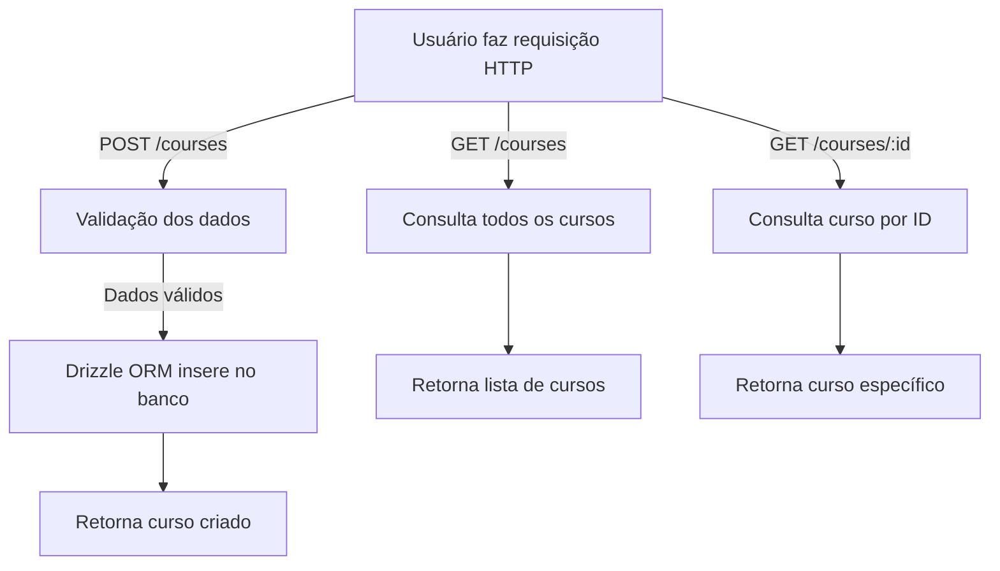

# Desafio API Node.js

Este projeto é uma API desenvolvida em Node.js para gerenciamento de cursos. Utiliza TypeScript, Drizzle ORM para manipulação do banco de dados, e está preparada para execução em ambiente Docker.

## Funcionalidades

- Criar curso
- Listar todos os cursos
- Buscar curso por ID

## Estrutura do Projeto

```
docker-compose.yml
server.ts
src/
  database/
    client.ts
    schema.ts
  routes/
    create-course.ts
    get-course-by-id.ts
    get-course.ts
```

## Tecnologias Utilizadas

- Node.js
- TypeScript
- Drizzle ORM
- Docker

## Como executar

1. **Clone o repositório:**
   ```bash
   git clone https://github.com/Rianxavier/desafio-api-nodejs.git
   cd desafio-api-nodejs
   ```
2. **Instale as dependências:**
   ```bash
   npm install
   ```
3. **Configure o banco de dados:**
   Edite o arquivo `docker-compose.yml` conforme necessário.

4. **Suba o banco de dados com Docker:**
   ```bash
   docker-compose up -d
   ```
5. **Inicie a aplicação:**
   ```bash
   npm run dev
   ```

## Rotas

- `POST /courses` - Cria um novo curso
- `GET /courses` - Lista todos os cursos
- `GET /courses/:id` - Busca curso pelo ID

## Observações

- Certifique-se de que o Docker esteja instalado e em execução.
- O Drizzle ORM é utilizado para facilitar a manipulação do banco de dados.

## Autor

## Diagrama de Fluxo Principal



## Rian Xavier

Este projeto faz parte de um desafio de API com Node.js.
